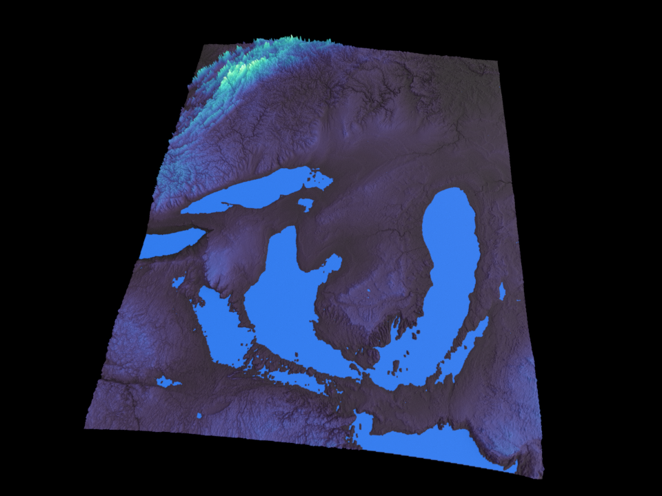
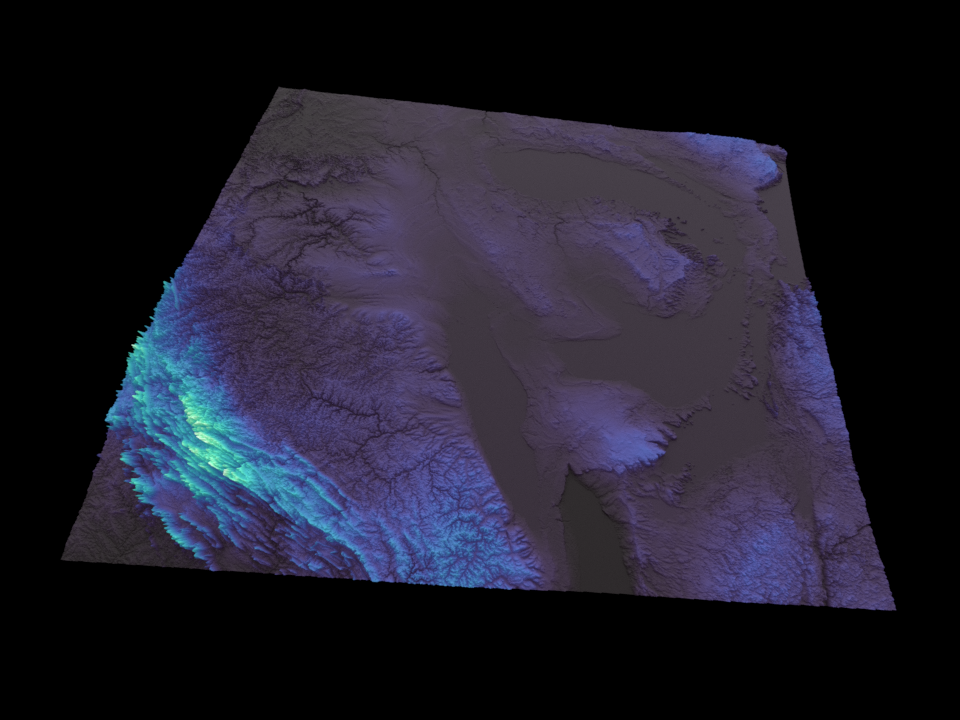
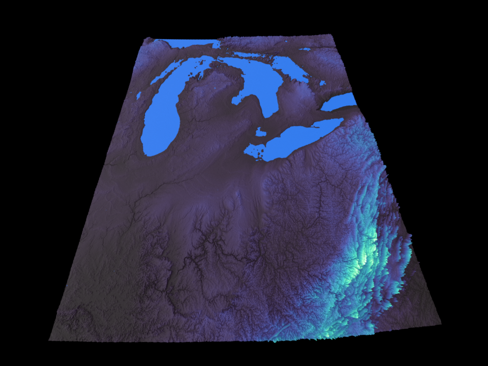
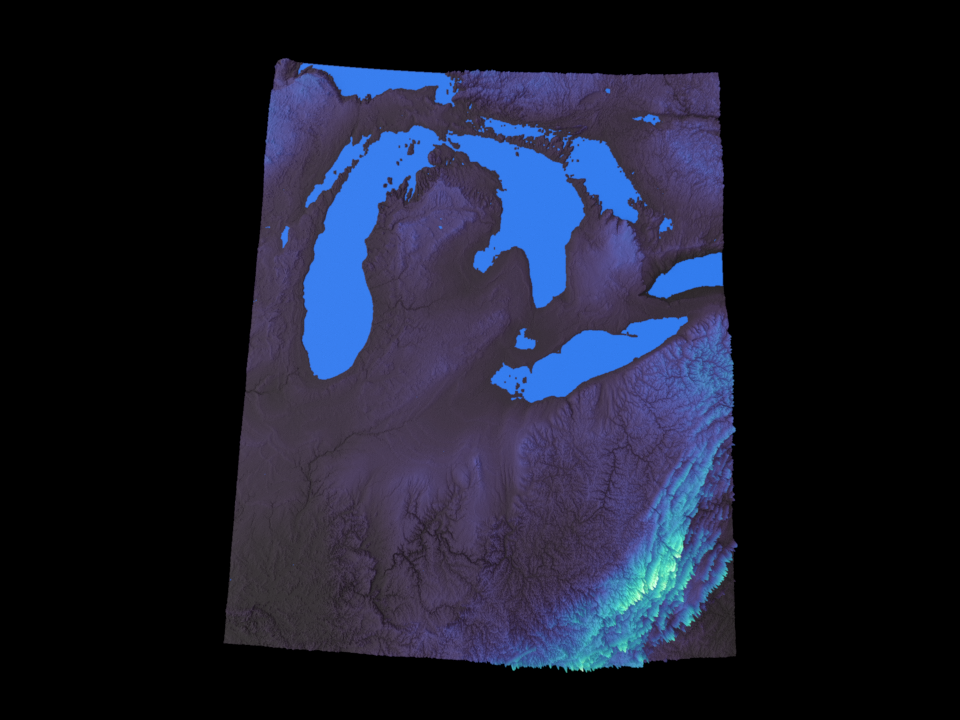

# Examples Gallery

Real-world examples demonstrating the power and simplicity of Terrain Maker.

## Detroit Elevation Visualization

A complete example showing how to create stunning 3D terrain visualizations from real SRTM elevation data with just a few lines of Python.

### The Result


*Professional-quality 3D terrain visualization of Detroit metro area - rendered with Blender from real SRTM elevation data*

### Multiple Views with Intelligent Camera Positioning

The example demonstrates the power of `position_camera_relative()` by generating professional renders from different camera angles - each with optimal framing for its view direction:

<div style="display: grid; grid-template-columns: repeat(3, 1fr); gap: 20px; margin: 20px 0;">
  <div style="text-align: center;">
    <strong>North View</strong><br/>
    <small>(looking south)</small><br/>
    
  </div>
  <div style="text-align: center;">
    <strong>East View</strong><br/>
    <small>(looking west)</small><br/>
    
  </div>
  <div style="text-align: center;">
    <strong>South View</strong><br/>
    <small>(looking north)</small><br/>
    
  </div>
  <div style="text-align: center; grid-column: 1;">
    <strong>West View</strong><br/>
    <small>(looking east)</small><br/>
    
  </div>
  <div style="text-align: center; grid-column: 2 / span 2;">
    <strong>Overhead View</strong><br/>
    <small>(90° down, zero rotation)</small><br/>
    
  </div>
</div>

**Generate these views yourself:**
```bash
npm run py:example:detroit-north     # or any of: south, east, west, above
```

Each view is automatically framed with intelligent target offset adjustments. No manual coordinate calculations needed!

### What This Example Shows

✓ **Loading Real Geographic Data**: Automatically loads and merges SRTM HGT tiles
✓ **Intelligent Mesh Optimization**: Configure mesh density by target vertex count, not magic numbers
✓ **Coordinate Transformation**: Automatic reprojection from WGS84 to UTM coordinates
✓ **Water Body Detection**: Automatic identification of water bodies using slope-based analysis
✓ **Intuitive Camera Control**: Position cameras using cardinal directions (north, south, above, etc)
✓ **Beautiful Visualization**: Professional Blender rendering with color mapping and water shader

### The Code

```python
# 1. Load elevation data
dem_data, transform = load_dem_files(SRTM_TILES_DIR, pattern='*.hgt')
terrain = Terrain(dem_data, transform)

# 2. Configure mesh for target vertices (intelligent downsampling)
terrain.configure_for_target_vertices(target_vertices=1_000_000)

# 3. Apply geographic transforms
terrain.transforms.append(reproject_raster('EPSG:4326', 'EPSG:32617'))
terrain.transforms.append(flip_raster(axis='horizontal'))
terrain.transforms.append(scale_elevation(scale_factor=0.0001))
terrain.apply_transforms()

# 4. Set up beautiful Mako color mapping
terrain.set_color_mapping(
    lambda dem: elevation_colormap(dem, cmap_name='mako'),
    source_layers=['dem']
)

# 5. Create mesh with water detection and render
mesh = terrain.create_mesh(
    scale_factor=100.0,
    height_scale=4.0,
    detect_water=True,              # Enable water body detection
    water_slope_threshold=0.5       # Flat areas (slope < 0.5°) are water
)
camera = position_camera_relative(mesh, direction='south', distance=1.5)
render_scene_to_file(output_path="detroit.png", width=960, height=720)
```

### Key Features in Action

#### Intelligent Downsampling
Instead of guessing downsampling factors, just tell Terrain Maker how many vertices you want:

```python
terrain.configure_for_target_vertices(1_000_000)  # Automatically calculates optimal zoom
```

#### Cardinal Direction Camera Positioning
No more confusing coordinate calculations. Position your camera intuitively with intelligent view-specific targeting:

```python
camera = position_camera_relative(
    mesh_obj,
    direction='south',      # Can be: north, south, east, west, northeast, etc.
    distance=1.5,           # Multiplier of mesh diagonal
    elevation=0.5,          # Height above center
    look_at=(0, -1.5, 0),   # View-specific target offset (auto-calculated)
)
```

**What makes this powerful:**
- Each cardinal direction has intelligent target offset adjustments
- North: targets (0, 2, 0) - offsets north for perfect framing
- South: targets (0, -1.5, 0) - offsets south for perfect framing
- East/West: adjust X axis similarly for optimal perspective
- The function automatically calculates rotation, distance, and elevation
- Overhead view uses zero rotation to eliminate gimbal lock artifacts

This eliminates trial-and-error camera positioning entirely!

#### Geographic Coordinate Handling
Automatic reprojection and proper coordinate system handling:

```python
terrain.transforms.append(reproject_raster(
    src_crs='EPSG:4326',      # WGS84 (from SRTM data)
    dst_crs='EPSG:32617',     # UTM Zone 17N (Detroit area)
    num_threads=4
))
```

#### Water Body Detection & Rendering
Automatic water body identification using slope-based analysis with blue shader coloring:

```python
# Create mesh with water detection enabled
mesh = terrain.create_mesh(
    scale_factor=100.0,
    height_scale=4.0,
    detect_water=True,              # Enable water body detection
    water_slope_threshold=0.5       # Flat areas (slope < 0.5°) are water
)

# Apply blue water shader to color water bodies
apply_water_shader(mesh.data.materials[0], water_color=(0.1, 0.4, 0.8))
```

**How it works:**

**Detection Phase:**
- Uses Sobel operators to compute terrain slope from elevation data
- Identifies pixels with slope below threshold as potential water bodies
- Applies morphological operations to smooth water boundaries and fill gaps
- Marks water pixels with alpha channel = 1.0 for shader-based rendering

**Rendering Phase:**
- `apply_water_shader()` configures a material with water-aware blending
- Uses vertex alpha channel to mix between water color and elevation colors
- Water areas (alpha = 1.0) render as beautiful blue
- Land areas (alpha = 0.0) show elevation colors from the Mako colormap
- Results in realistic visualization with distinct water features

**Customization:**
- Adjust `water_slope_threshold` to find more or fewer water bodies (higher = more sensitive)
- Change water color by passing `water_color` parameter: `apply_water_shader(material, water_color=(0.2, 0.5, 0.9))`
- Threshold of 0.5° works well for most real-world elevation data

### Running This Example

#### Basic Render
```bash
python examples/detroit_elevation_real.py
```

This will:
1. Load SRTM elevation tiles from `data/dem/detroit/`
2. Process the data with intelligent downsampling
3. Generate a 1,370,951 vertex Blender mesh
4. Render a publication-quality PNG (2.0 MB) from the north
5. Save a Blender file for further editing

#### Generate Multiple Views
The example supports command-line arguments to easily create renders from different camera angles:

```bash
# Quick commands for each cardinal direction
npm run py:example:detroit-north    # North view
npm run py:example:detroit-south    # South view
npm run py:example:detroit-east     # East view
npm run py:example:detroit-west     # West view
npm run py:example:detroit-above    # Overhead bird's-eye view
```

Each renders the same terrain from a different perspective with intelligent view-specific framing. Perfect for creating comparison sets or presentations!

### Example Output

When you run the example, you'll see output like this:

```
======================================================================
Detroit Real Elevation Visualization
======================================================================
✓ Blender scene cleared
[1/6] Loading SRTM tiles...
Opening DEM files: 100%|██████████| 110/110 [00:00<00:00, 1530.60it/s, opened=110]

[2/6] Initializing Terrain object...
      Terrain initialized
      DEM shape: (36001, 39601)

[3/6] Applying transforms...
      Original DEM shape: (36001, 39601)
      Configured for 1,382,400 target vertices
      Calculated zoom_factor: 0.031139
      Downsampled DEM shape: (1326, 1137)
      Actual vertices: 1,507,662
      Transforms applied successfully

[4/6] Setting up color mapping...
      Color mapping configured (Mako colormap)

[5/6] Creating Blender mesh...
      ✓ Mesh created successfully!
      Vertices: 1370951
      Polygons: 1368731

[6/6] Setting up camera and rendering to PNG...
      Camera: South-facing cardinal view
      Direction: south, distance: 1.5x, elevation: 0.5x
      Type: Orthographic
      Samples: 32
      Rendering...
      ✓ Rendered successfully!
      File: detroit_elevation_real.png
      Size: 2.0 MB

======================================================================
Detroit Real Elevation Visualization Complete!
======================================================================

Summary:
  ✓ Loaded and merged all SRTM tiles (full coverage)
  ✓ Configured downsampling to target vertex count intelligently
  ✓ Applied geographic coordinate reprojection (WGS84 → UTM)
  ✓ Created Terrain object with real elevation data
  ✓ Applied transforms (reproject + flip + scale)
  ✓ Configured beautiful Mako elevation-based color mapping
  ✓ Detected and applied water bodies (slope-based identification)
  ✓ Generated Blender mesh with 1370951 vertices
  ✓ Rendered to PNG: /path/to/detroit_elevation_real.png

That's it! Professional terrain visualization with water detection in just a few lines of Python!
```

The entire process takes about 30-40 seconds on modern hardware. You'll see progress bars for DEM loading and processing, with detailed logging of each transformation step.

### Output Files

- `examples/detroit_elevation_real.png` - Final rendered image (960×720, 2.0 MB)
- `examples/detroit_elevation_real.blend` - Blender file for further editing

### Why Terrain Maker Makes This Easy

Traditional terrain visualization typically requires:
- Manual downsampling factor calculation
- Complex coordinate reprojection setup
- Blender scripting knowledge
- Camera positioning through trial-and-error

With Terrain Maker, you get:
- **Automatic mesh optimization** by target vertex count
- **Built-in geographic transforms** with sensible defaults
- **Water body detection** using slope-based analysis
- **Intuitive cardinal direction camera positioning**
- **Professional Blender integration** out of the box
- **Color mapping from elevation data** in one line
- **Water shader rendering** for realistic water visualization

### Customization

#### Command-Line Camera Control
The example script accepts arguments to customize rendering without code changes:

```bash
# Change view direction
python examples/detroit_elevation_real.py --view east

# Adjust camera distance (closer/farther)
python examples/detroit_elevation_real.py --view north --distance 0.15

# Change elevation (higher/lower viewpoint)
python examples/detroit_elevation_real.py --view above --elevation 0.8

# Custom output filename
python examples/detroit_elevation_real.py --view west --output my_render.png

# Switch to orthographic projection
python examples/detroit_elevation_real.py --view north --camera-type ORTHO
```

#### In-Code Customization

```python
# Change the colormap
elevation_colormap(dem, cmap_name='viridis')    # Other options: turbo, plasma, etc.

# Adjust camera angle
position_camera_relative(mesh, direction='east', elevation=1.0)

# Configure rendering
setup_render_settings(samples=4096, use_denoising=True)

# Create a presentation set of all views
for view in ['north', 'south', 'east', 'west', 'above']:
    position_camera_relative(mesh, direction=view)
    render_scene_to_file(output_path=f"detroit_{view}.png")
```

#### Generating Multiple Comparison Views

Create a full set of renders for comparison or publication:

```bash
# Generate all cardinal views at once
for view in north south east west above; do
    npm run py:example:detroit-$view
done
```

This creates 5 renders showing the terrain from different perspectives, with consistent framing and optimal camera positioning for each angle.

---

**Want to try it yourself?** See [Quick Reference](QUICK_REFERENCE.md) for API documentation and [API Reference](API_REFERENCE.md) for detailed function signatures.
