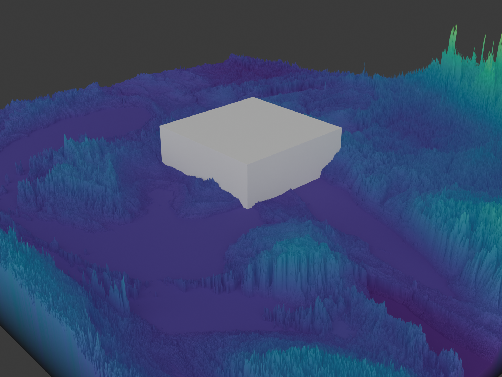

# Examples Gallery

Real-world examples demonstrating the power and simplicity of Terrain Maker.

## Detroit Elevation Visualization

A complete example showing how to create stunning 3D terrain visualizations from real SRTM elevation data with just a few lines of Python.

### The Result



*Professional-quality 3D terrain visualization of Detroit metro area - rendered with Blender from real SRTM elevation data*

### What This Example Shows

✓ **Loading Real Geographic Data**: Automatically loads and merges SRTM HGT tiles
✓ **Intelligent Mesh Optimization**: Configure mesh density by target vertex count, not magic numbers
✓ **Coordinate Transformation**: Automatic reprojection from WGS84 to UTM coordinates
✓ **Intuitive Camera Control**: Position cameras using cardinal directions (north, south, above, etc)
✓ **Beautiful Visualization**: Professional Blender rendering with color mapping

### The Code

```python
# 1. Load elevation data
dem_data, transform = load_dem_files(SRTM_TILES_DIR, pattern='*.hgt')
terrain = Terrain(dem_data, transform)

# 2. Configure mesh for target vertices (intelligent downsampling)
terrain.configure_for_target_vertices(target_vertices=1_000_000)

# 3. Apply geographic transforms
terrain.transforms.append(reproject_raster('EPSG:4326', 'EPSG:32617'))
terrain.transforms.append(flip_raster(axis='horizontal'))
terrain.transforms.append(scale_elevation(scale_factor=0.0001))
terrain.apply_transforms()

# 4. Set up beautiful Mako color mapping
terrain.set_color_mapping(
    lambda dem: elevation_colormap(dem, cmap_name='mako'),
    source_layers=['dem']
)

# 5. Create mesh and render
mesh = terrain.create_mesh(scale_factor=100.0, height_scale=4.0)
camera = position_camera_relative(mesh, direction='south', distance=1.5)
render_scene_to_file(output_path="detroit.png", width=960, height=720)
```

### Key Features in Action

#### Intelligent Downsampling
Instead of guessing downsampling factors, just tell Terrain Maker how many vertices you want:

```python
terrain.configure_for_target_vertices(1_000_000)  # Automatically calculates optimal zoom
```

#### Cardinal Direction Camera Positioning
No more confusing coordinate calculations. Position your camera intuitively:

```python
camera = position_camera_relative(
    mesh_obj,
    direction='south',      # Can be: north, south, east, west, northeast, etc.
    distance=1.5,           # Multiplier of mesh diagonal
    elevation=0.5,          # Height above center
)
```

#### Geographic Coordinate Handling
Automatic reprojection and proper coordinate system handling:

```python
terrain.transforms.append(reproject_raster(
    src_crs='EPSG:4326',      # WGS84 (from SRTM data)
    dst_crs='EPSG:32617',     # UTM Zone 17N (Detroit area)
    num_threads=4
))
```

### Running This Example

```bash
python examples/detroit_elevation_real.py
```

This will:
1. Load SRTM elevation tiles from `data/dem/detroit/`
2. Process the data with intelligent downsampling
3. Generate a 1,370,951 vertex Blender mesh
4. Render a publication-quality PNG (2.0 MB)
5. Save a Blender file for further editing

### Output Files

- `examples/detroit_elevation_real.png` - Final rendered image (960×720, 2.0 MB)
- `examples/detroit_elevation_real.blend` - Blender file for further editing

### Why Terrain Maker Makes This Easy

Traditional terrain visualization typically requires:
- Manual downsampling factor calculation
- Complex coordinate reprojection setup
- Blender scripting knowledge
- Camera positioning through trial-and-error

With Terrain Maker, you get:
- **Automatic mesh optimization** by target vertex count
- **Built-in geographic transforms** with sensible defaults
- **Intuitive cardinal direction camera positioning**
- **Professional Blender integration** out of the box
- **Color mapping from elevation data** in one line

### Customization

You can easily customize this example for your own data:

```python
# Change the colormap
elevation_colormap(dem, cmap_name='viridis')    # Other options: turbo, plasma, etc.

# Adjust camera angle
position_camera_relative(mesh, direction='east', elevation=1.0)

# Configure rendering
setup_render_settings(samples=4096, use_denoising=True)
```

---

**Want to try it yourself?** See [Quick Reference](QUICK_REFERENCE.md) for API documentation and [API Reference](API_REFERENCE.md) for detailed function signatures.
