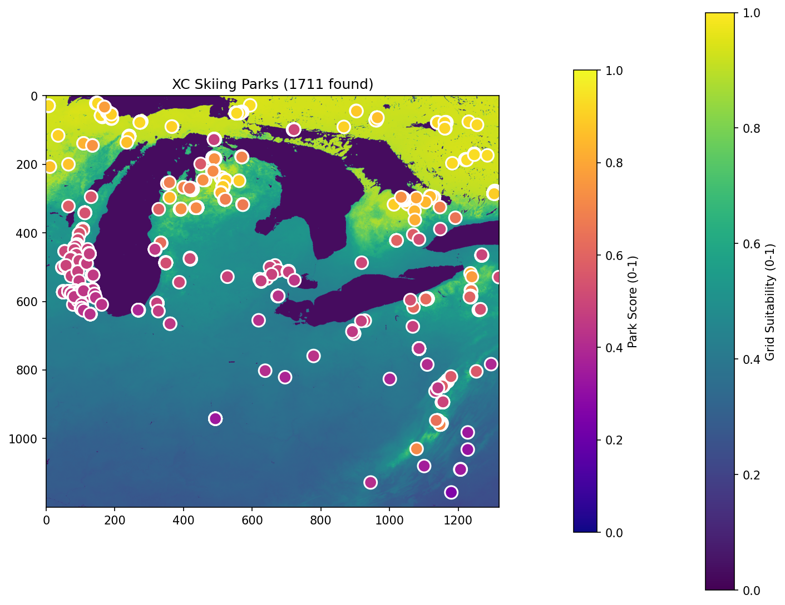
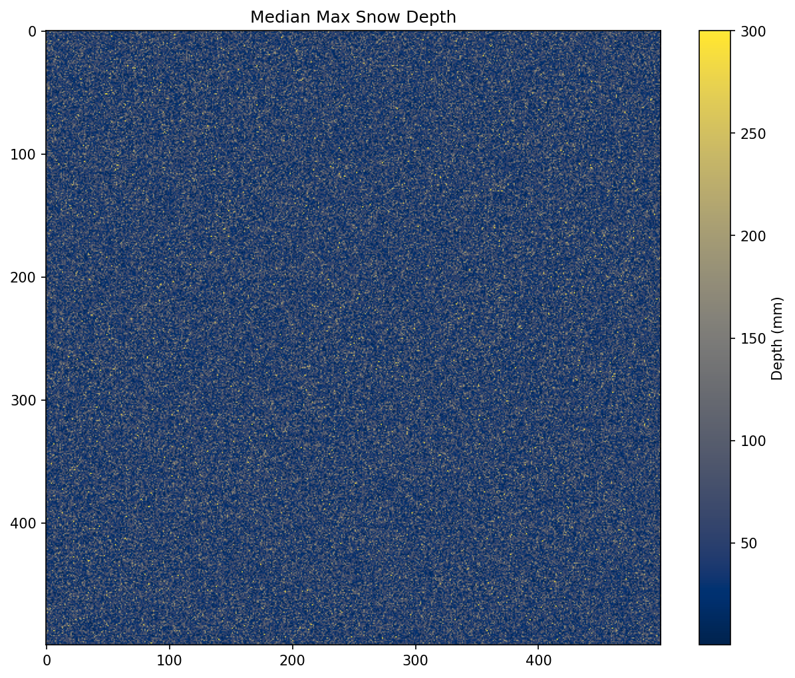
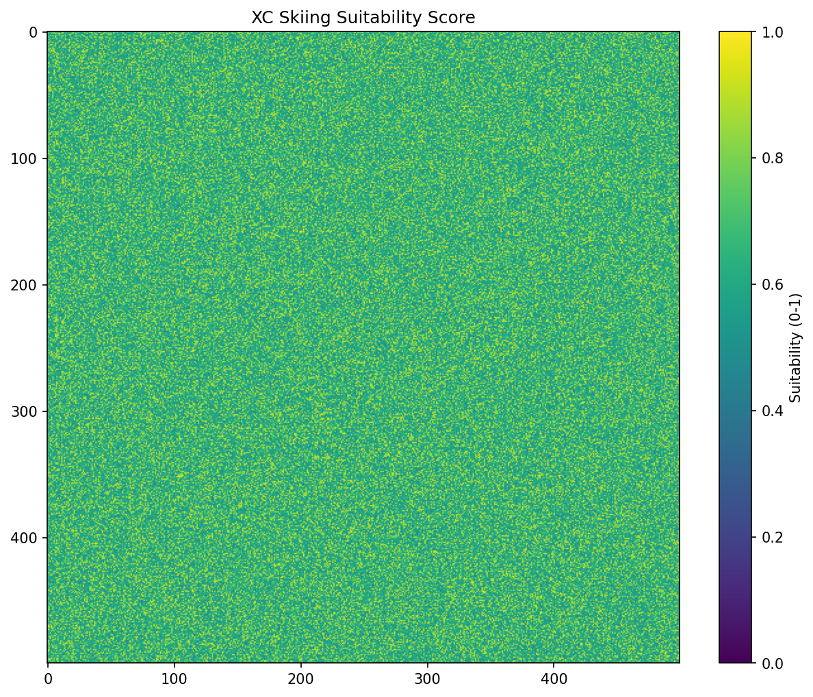

# Cross-Country Skiing Location Analysis

A complete example showing how to combine elevation data with SNODAS snow statistics to identify optimal cross-country skiing locations across the Great Lakes region. This demonstrates multi-layer terrain analysis with real OpenStreetMap park data.

## The Final Result

This pipeline produces a comprehensive XC skiing suitability map with 1,700+ real skiing locations:



**What You're Seeing:**

- **Background (viridis colormap)**: Snow suitability score grid (0-1)
- **Circles (plasma colormap)**: Real XC skiing locations from OpenStreetMap, colored by local score
- **Dark blue areas**: Great Lakes (Lake Michigan, Lake Huron, Lake Erie)
- **Yellow/green areas**: Higher snow suitability regions

**Score Interpretation:**

- **0.7-1.0 (Yellow)**: Excellent XC skiing conditions
- **0.5-0.7 (Green)**: Good skiing with reliable snow
- **0.3-0.5 (Teal)**: Moderate - marginal conditions
- **0.0-0.3 (Blue/Purple)**: Poor skiing potential

---

## What This Example Shows

- **OpenStreetMap Integration**: Fetches 1,700+ real XC skiing locations via Overpass API
- **Multi-Layer Analysis**: Combines terrain elevation with snow depth/coverage data
- **SNODAS Integration**: Processes real National Snow and Ice Data Center snow grids
- **Location Scoring**: Scores each park based on local snow conditions
- **Viridis-Family Colormaps**: Professional visualization with perceptually uniform colors
- **Mock Data Support**: Fast testing with realistic synthetic snow data

## The Pipeline

```
DEM → Snow Statistics → XC Skiing Score → Fetch Parks → Score Parks → Visualization
```

Each stage produces visual artifacts:

1. **Snow Depth**: Median maximum snow depth (cividis colormap)
2. **Suitability Score**: Combined XC skiing score grid (viridis colormap)
3. **Parks Overlay**: Real skiing locations colored by local score (plasma colormap)

## Pipeline Visualizations

### Step 1: Snow Depth Analysis



Median maximum snow depth across the region, showing the snow belt effect around the Great Lakes.

### Step 2: XC Skiing Suitability Score



Combined suitability score incorporating:

- Snow depth (adequate base required)
- Snow coverage (consistent coverage preferred)
- Snow consistency (low variability is better)

### Step 3: Parks with Scores


Real XC skiing locations from OpenStreetMap, each scored based on local snow conditions.

## The Code

```python
from pathlib import Path
from src.terrain.core import Terrain
from src.terrain.data_loading import load_dem_files
from src.terrain.gridded_data import GriddedDataLoader, TiledDataConfig
from src.snow import batch_process_snodas_data, calculate_snow_statistics
from src.scoring.configs import DEFAULT_XC_SKIING_SCORER

# 1. Load elevation data
dem_dir = Path("data/dem/detroit")
dem, transform = load_dem_files(dem_dir)
terrain = Terrain(dem, transform, dem_crs="EPSG:4326")

# 2. Load snow data with memory-safe tiled processing
tile_config = TiledDataConfig(max_output_pixels=4_000_000)
loader = GriddedDataLoader(terrain=terrain, tile_config=tile_config)

pipeline = [
    ("load_snodas", batch_process_snodas_data, {}),
    ("compute_stats", calculate_snow_statistics, {}),
]

snow_stats = loader.run_pipeline(
    data_source=Path("data/snodas_data"),
    pipeline=pipeline,
    cache_name="xc_snodas",
)

# 3. Compute XC skiing suitability scores
from src.scoring.configs import xc_skiing_compute_derived_inputs
inputs = xc_skiing_compute_derived_inputs(snow_stats)
score_grid = DEFAULT_XC_SKIING_SCORER.compute(inputs)

# 4. Fetch real parks from OpenStreetMap
# The example script queries Overpass API for piste:type=nordic, etc.
parks = fetch_xc_skiing_parks(terrain.dem_bounds)

# 5. Score each park based on local snow conditions
scored_parks = compute_park_scores(parks, score_grid, transform)
```

## Running This Example

### Quick Start with Mock Data

Test the pipeline quickly with synthetic data:

```bash
# Generate all visualizations with mock data
npm run py:example:xc-skiing:mock
```

This uses realistic mock snow data and fetches real park locations from OpenStreetMap.

### Using Real SNODAS Data

Process real snow data from the National Snow and Ice Data Center:

```bash
# Full pipeline with real SNODAS data
npm run py:example:xc-skiing:real
```

Or run the Python script directly:

```bash
# With mock data
uv run python examples/detroit_xc_skiing.py --mock-data

# With real SNODAS data
uv run python examples/detroit_xc_skiing.py --snodas-dir data/snodas_data

# Custom output directory
uv run python examples/detroit_xc_skiing.py --output-dir ./my_outputs --mock-data
```

## OpenStreetMap Data

The example fetches real XC skiing locations using the Overpass API with these tags:

- `piste:type=nordic` - Nordic ski trails
- `sport=cross-country_skiing` - XC skiing facilities
- `landuse=winter_sports` - Winter sports areas
- `route=ski` - Ski routes

**Regional Distribution (Great Lakes):**

| Region | Parks Found |
|--------|-------------|
| Central Michigan/Wisconsin | ~700 |
| Lower Michigan/N Indiana/N Ohio | ~530 |
| Upper Michigan/Wisconsin | ~310 |
| S Ohio/Indiana/Illinois | ~170 |
| Kentucky/West Virginia | ~10 |

## Output Files

The example generates these outputs in `docs/images/xc_skiing/`:

| File | Description |
|------|-------------|
| `01_snow/snow_depth.png` | Snow depth visualization |
| `02_xc_scores/xc_skiing_scores.png` | Suitability score grid |
| `03_parks/parks_on_score_map.png` | Parks overlaid on score map |
| `xc_skiing_parks.geojson` | Park locations in GeoJSON format |
| `xc_skiing_parks.json` | Scored parks with coordinates |
| `xc_skiing_scores.npz` | Score grid as numpy array |

## Scoring Configuration

The XC skiing scorer uses these factors:

```python
DEFAULT_XC_SKIING_SCORER = ScoringConfig(
    name="xc_skiing",
    factors=[
        ScoringFactor(
            name="snow_depth",
            weight=0.4,
            transform=lambda x: np.clip(x / 300, 0, 1),  # 300mm = ideal
        ),
        ScoringFactor(
            name="snow_coverage",
            weight=0.35,
            transform=lambda x: x,  # Already 0-1 ratio
        ),
        ScoringFactor(
            name="snow_consistency",
            weight=0.25,
            transform=lambda x: 1 - x,  # Lower CV is better
        ),
    ],
)
```

See [Scoring Configuration](SCORING_CONFIG.md) for details on customizing scores.

## See Also

- [Snow Sledding Analysis](SNOW_SLEDDING.md) - Similar example for sledding locations
- [API Reference](API_REFERENCE.md) - Full API documentation
- [Scoring Configuration](SCORING_CONFIG.md) - Customize scoring factors
