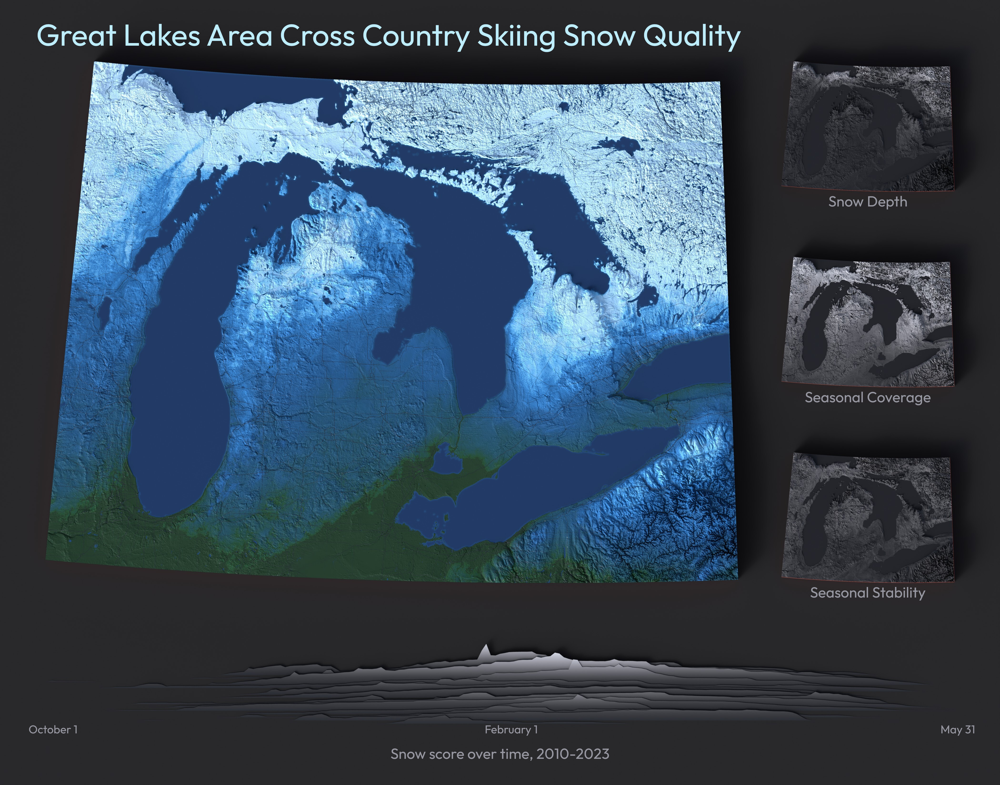
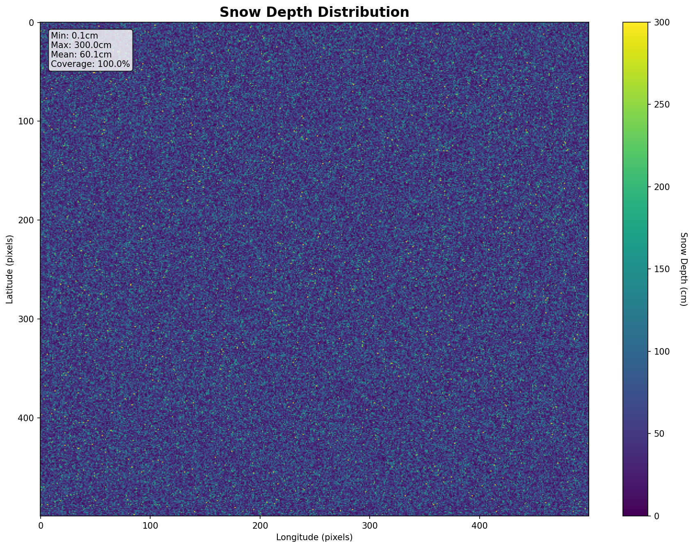
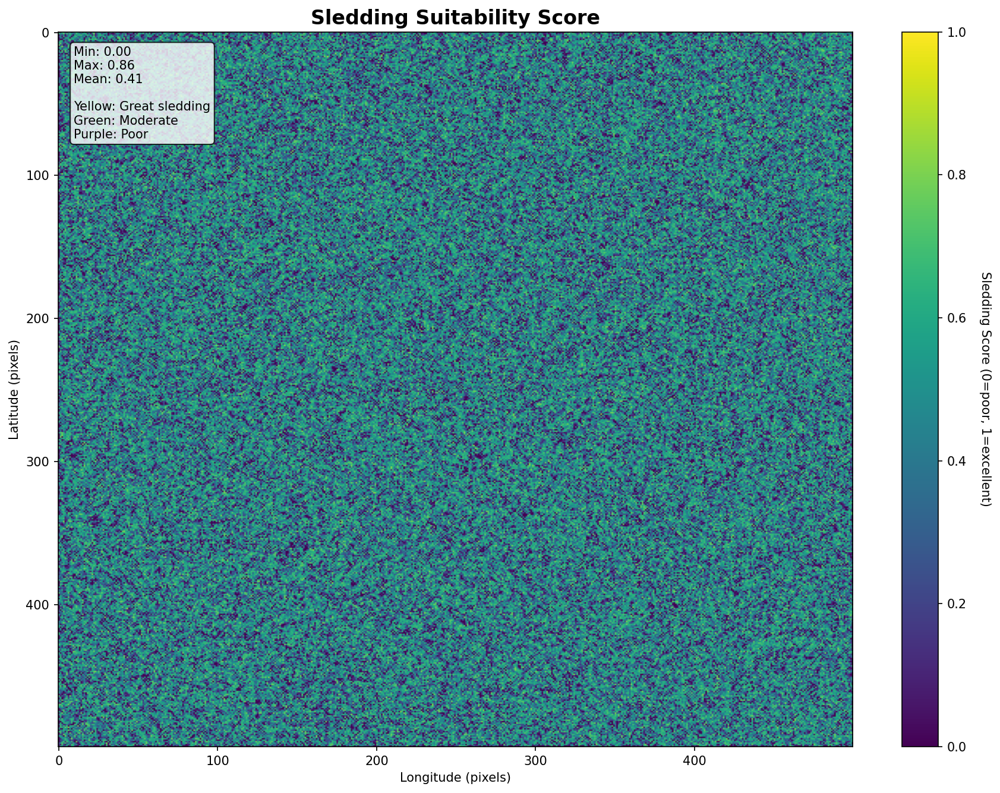

# Gallery

Example renders produced with terrain-maker. Each image links to the example or guide that explains how it was made.

---

## Detroit: Sledding + XC Skiing (Combined Render)

The flagship example — dual colormaps blending sledding and cross-country skiing scores, with roads and parks overlay, rendered at print quality.

Sledding scores (boreal-mako colormap) underlie the terrain. XC skiing scores (mako/rocket overlay) appear near parks. Azurite-colored roads mark major routes. The labeled version identifies specific parks and features.

**Script:** `examples/detroit_combined_render.py`
**Guide:** {doc}`examples/combined_render`

---

## San Diego: Complete Minimal Example

The recommended starting point — a full terrain pipeline in ~180 lines: download SRTM elevation data, load and transform a DEM, detect water, generate a 3D mesh, and render with professional HDRI lighting.

Elevation mapped with the plasma colormap; San Diego Bay and coastal water detected and highlighted automatically.

**Script:** `examples/san_diego_flow_demo.py`
**Guide:** {doc}`examples/san_diego_demo`

---

## Detroit: Dual Colormap Render

An earlier dual-layer render of the Detroit area showing sledding and XC skiing zones side by side.

**Script:** `examples/detroit_dual_render.py`
**Guide:** {doc}`examples/sledding`

---

## Detroit: Elevation — Cardinal Views

Pure elevation renders of the Detroit area from five vantage points. The custom Michigan colormap maps Great Lakes blue through forest green to upland sand tones.

<table>
<tr>
<td width="50%">

*Above*

</td>
<td width="50%">

*South*

</td>
</tr>
<tr>
<td>

*North*

</td>
<td>

*East*

</td>
</tr>
</table>

**Script:** `examples/detroit_elevation_real.py`
**Guide:** {doc}`examples/elevation`

---

## Snow Sledding Score Analysis

Step-by-step breakdown of the sledding score computation for southeast Michigan, from raw inputs to final score map.

<table>
<tr>
<td width="33%">

*Elevation (DEM)*

</td>
<td width="33%">

*Snow depth*

</td>
<td width="33%">

*Final sledding score*

</td>
</tr>
</table>

**Guide:** {doc}`examples/sledding`
