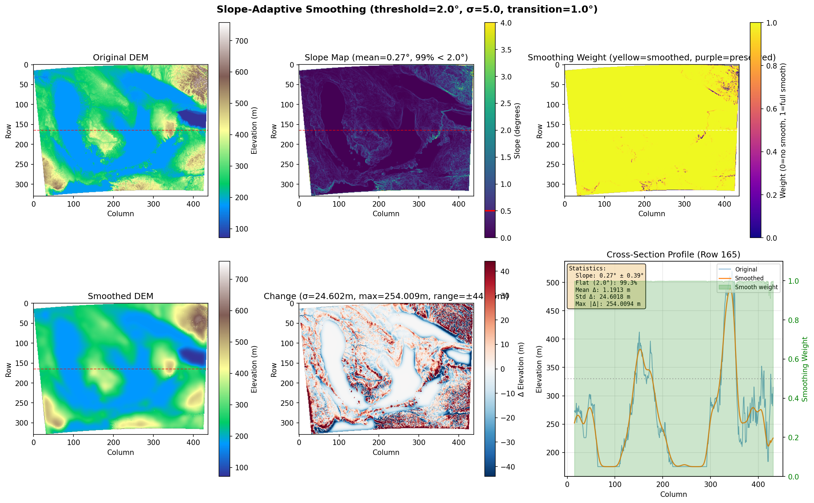
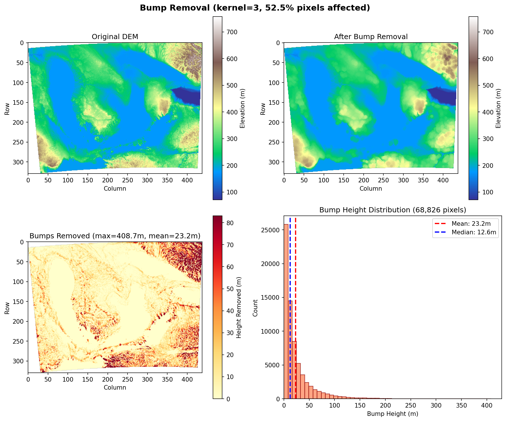
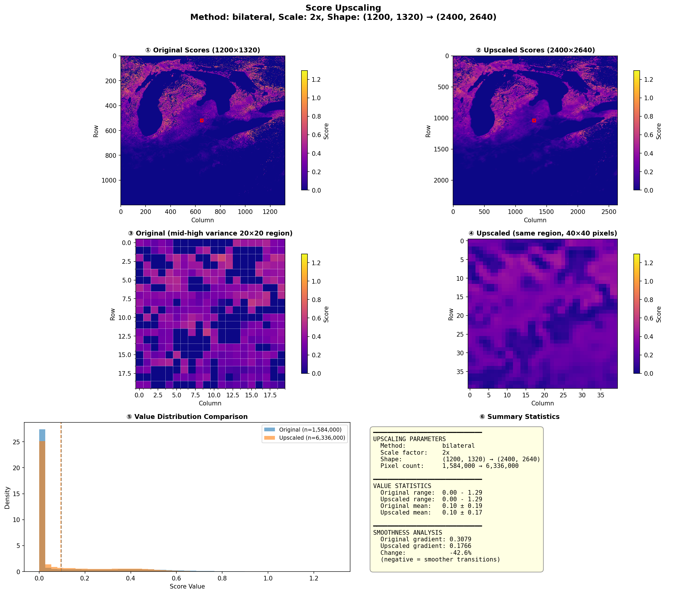

# Diagnostic Tools

Terrain-maker includes comprehensive diagnostic tools for visualizing and debugging terrain processing pipelines. These tools help you understand how transforms affect your data and optimize rendering parameters.

## Overview

The `terrain.diagnostics` module provides visualization functions for:

- **Wavelet denoising** - Analyze noise removal and frequency decomposition
- **Slope-adaptive smoothing** - Visualize smoothing intensity based on terrain slope
- **Bump removal** - Debug morphological filtering effects
- **Score upscaling** - Compare original vs upscaled score grids
- **Render histograms** - Analyze color distribution in output images

## Wavelet Denoising Diagnostics

### plot_wavelet_diagnostics

Shows before/after comparison of wavelet denoising with difference maps and cross-section profiles.

```python
from src.terrain.diagnostics import plot_wavelet_diagnostics

plot_wavelet_diagnostics(
    original=dem_original,
    denoised=dem_denoised,
    output_path=Path("diagnostics/wavelet.png"),
    title_prefix="DEM Wavelet Denoising",
    profile_row=500,  # Row for cross-section
)
```

**Output panels:**
1. Original DEM
2. Denoised DEM
3. Difference (noise removed)
4. Cross-section profile comparison

### plot_wavelet_coefficients

Visualizes the wavelet decomposition showing detail coefficients at each level.

```python
from src.terrain.diagnostics import plot_wavelet_coefficients

plot_wavelet_coefficients(
    data=dem_data,
    output_path=Path("diagnostics/wavelet_coeffs.png"),
    wavelet="db4",
    levels=3,
)
```

### generate_full_wavelet_diagnostics

Generates complete wavelet diagnostic report with multiple visualizations.

```python
from src.terrain.diagnostics import generate_full_wavelet_diagnostics

generate_full_wavelet_diagnostics(
    original=dem_original,
    denoised=dem_denoised,
    output_dir=Path("diagnostics/"),
    wavelet="db4",
    levels=3,
    threshold_sigma=2.0,
)
```

## Slope-Adaptive Smoothing Diagnostics

### plot_adaptive_smooth_diagnostics

Visualizes how smoothing varies based on terrain slope - showing more smoothing on flat areas and less on steep terrain.

```python
from src.terrain.diagnostics import plot_adaptive_smooth_diagnostics

plot_adaptive_smooth_diagnostics(
    original=dem_original,
    smoothed=dem_smoothed,
    output_path=Path("diagnostics/adaptive_smooth.png"),
    pixel_size=30.0,  # meters per pixel
)
```



**Output panels:**
1. Original DEM
2. Smoothed DEM
3. Computed slope map
4. Smoothing weight mask (bright = more smoothing)
5. Difference map
6. Cross-section profiles

### plot_adaptive_smooth_histogram

Shows histograms comparing original vs smoothed elevation distributions.

```python
from src.terrain.diagnostics import plot_adaptive_smooth_histogram

plot_adaptive_smooth_histogram(
    original=dem_original,
    smoothed=dem_smoothed,
    output_path=Path("diagnostics/adaptive_histogram.png"),
)
```


## Bump Removal Diagnostics

### plot_bump_removal_diagnostics

Visualizes morphological bump removal showing original, smoothed, and removed features.

```python
from src.terrain.diagnostics import plot_bump_removal_diagnostics

plot_bump_removal_diagnostics(
    original=dem_original,
    smoothed=dem_smoothed,
    output_path=Path("diagnostics/bump_removal.png"),
    kernel_size=5,
    structure="disk",
)
```



**Output panels:**
1. Original DEM
2. After bump removal
3. Removed features (bumps)
4. Histograms of elevation changes

## Score Upscaling Diagnostics

### plot_upscale_diagnostics

Compares original and upscaled score grids with zoomed regions and histograms.

```python
from src.terrain.diagnostics import plot_upscale_diagnostics

plot_upscale_diagnostics(
    original=scores_lowres,
    upscaled=scores_hires,
    output_path=Path("diagnostics/upscale.png"),
    scale=4,
    method="esrgan",
    title_prefix="Sledding Scores",
)
```



**Output panels:**
1. Original score grid (full view)
2. Upscaled score grid (full view)
3. Zoomed comparison of high-variance region
4. Value distribution histograms
5. Edge sharpness comparison

### generate_upscale_diagnostics

Convenience function that handles file paths and method detection.

```python
from src.terrain.diagnostics import generate_upscale_diagnostics

generate_upscale_diagnostics(
    original=scores,
    upscaled=scores_upscaled,
    output_dir=Path("diagnostics/"),
    name="sledding",
    scale=4,
    method="esrgan",
)
```

## Render Histogram Analysis

### generate_rgb_histogram

Creates RGB channel histograms for rendered images to analyze color balance.

```python
from src.terrain.diagnostics import generate_rgb_histogram

generate_rgb_histogram(
    image_path=Path("render.png"),
    output_path=Path("render_histogram.png"),
)
```

**Shows:**
- Overlaid R, G, B channel histograms
- Mean and standard deviation for each channel
- Useful for detecting color casts or imbalances

### generate_luminance_histogram

Creates luminance (brightness) histogram with clipping analysis.

```python
from src.terrain.diagnostics import generate_luminance_histogram

generate_luminance_histogram(
    image_path=Path("render.png"),
    output_path=Path("render_luminance.png"),
)
```

**Shows:**
- Luminance distribution (ITU-R BT.601 formula)
- Pure black (0) and pure white (255) pixel counts
- Clipping warnings for print preparation

## CLI Integration

The `detroit_combined_render.py` example automatically generates diagnostics when using certain flags:

```bash
# Generate upscale diagnostics
python examples/detroit_combined_render.py --upscale-scores

# Generates:
#   diagnostics/sledding_upscale_diagnostics.png
#   diagnostics/xc_upscale_diagnostics.png

# Generate adaptive smooth diagnostics
python examples/detroit_combined_render.py --adaptive-smooth --diagnostics

# Generate all render diagnostics (histograms)
python examples/detroit_combined_render.py --print-quality

# Generates:
#   output_histogram.png
#   output_luminance.png
```

## Best Practices

### When to Use Diagnostics

1. **Tuning parameters** - Use diagnostics to find optimal values for smoothing, denoising, upscaling
2. **Debugging artifacts** - Identify source of visual problems in renders
3. **Print preparation** - Check histograms for clipping before printing
4. **Quality assurance** - Verify transforms produce expected results

### Performance Considerations

- Diagnostic plots add ~1-3 seconds to processing time
- Large arrays (>4000x4000) may use significant memory for plotting
- Consider generating diagnostics only during development, not production

## API Reference

```{eval-rst}
.. autofunction:: terrain.diagnostics.plot_wavelet_diagnostics
.. autofunction:: terrain.diagnostics.plot_wavelet_coefficients
.. autofunction:: terrain.diagnostics.generate_full_wavelet_diagnostics
.. autofunction:: terrain.diagnostics.plot_adaptive_smooth_diagnostics
.. autofunction:: terrain.diagnostics.plot_adaptive_smooth_histogram
.. autofunction:: terrain.diagnostics.generate_full_adaptive_smooth_diagnostics
.. autofunction:: terrain.diagnostics.plot_bump_removal_diagnostics
.. autofunction:: terrain.diagnostics.generate_bump_removal_diagnostics
.. autofunction:: terrain.diagnostics.plot_upscale_diagnostics
.. autofunction:: terrain.diagnostics.generate_upscale_diagnostics
.. autofunction:: terrain.diagnostics.generate_rgb_histogram
.. autofunction:: terrain.diagnostics.generate_luminance_histogram
```

## See Also

- {doc}`../examples/combined_render` - Full example using diagnostics
- {func}`~terrain.transforms.wavelet_denoise_dem` - Wavelet denoising transform
- {func}`~terrain.transforms.slope_adaptive_smooth` - Adaptive smoothing transform
- {func}`~terrain.transforms.upscale_scores` - Score upscaling function
