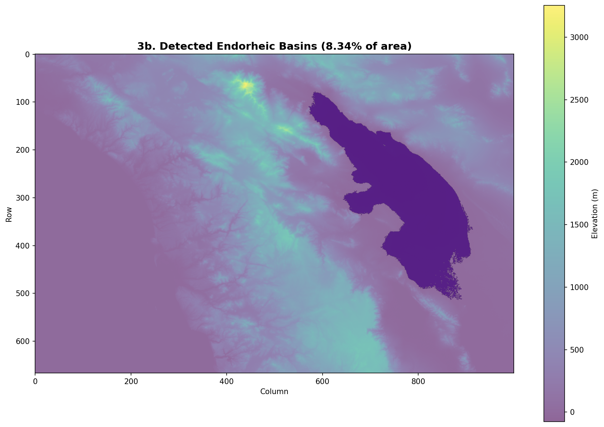
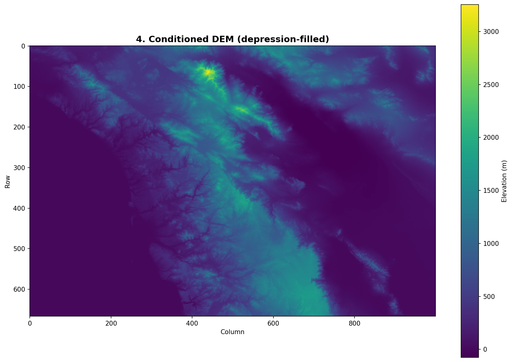
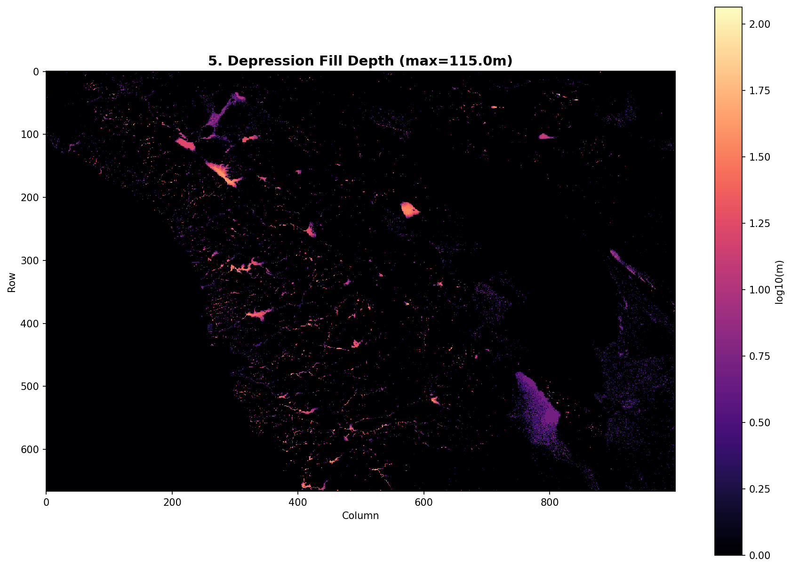
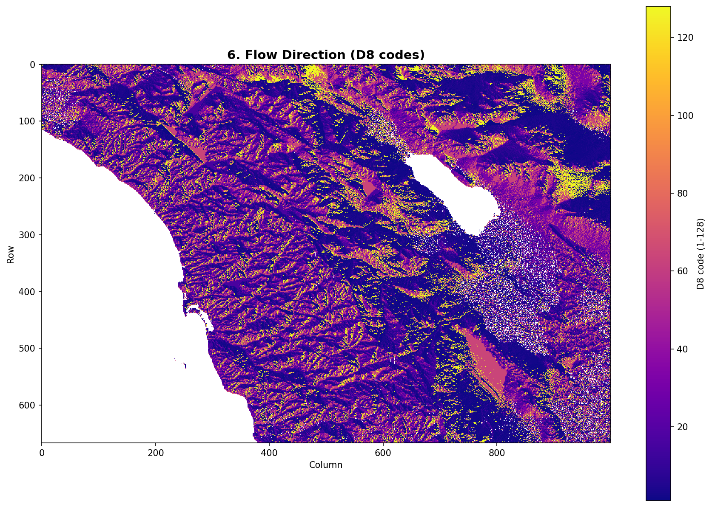
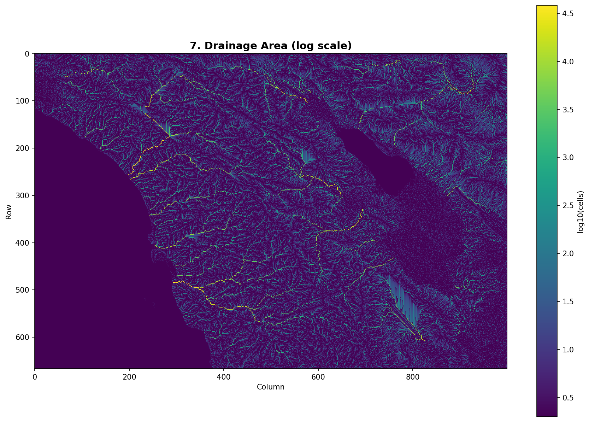
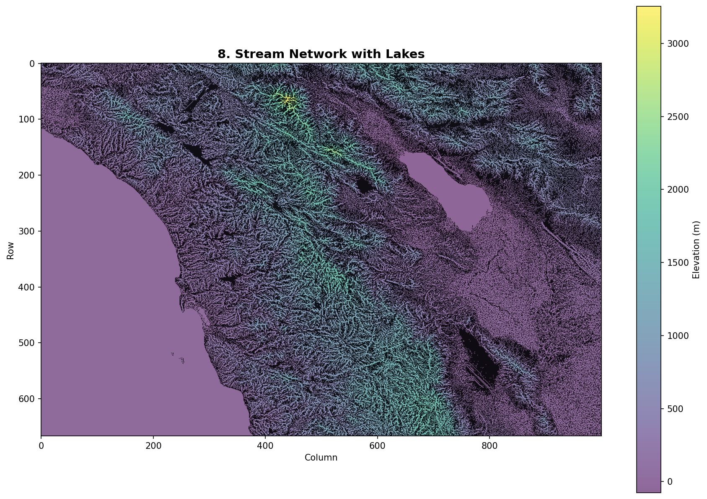
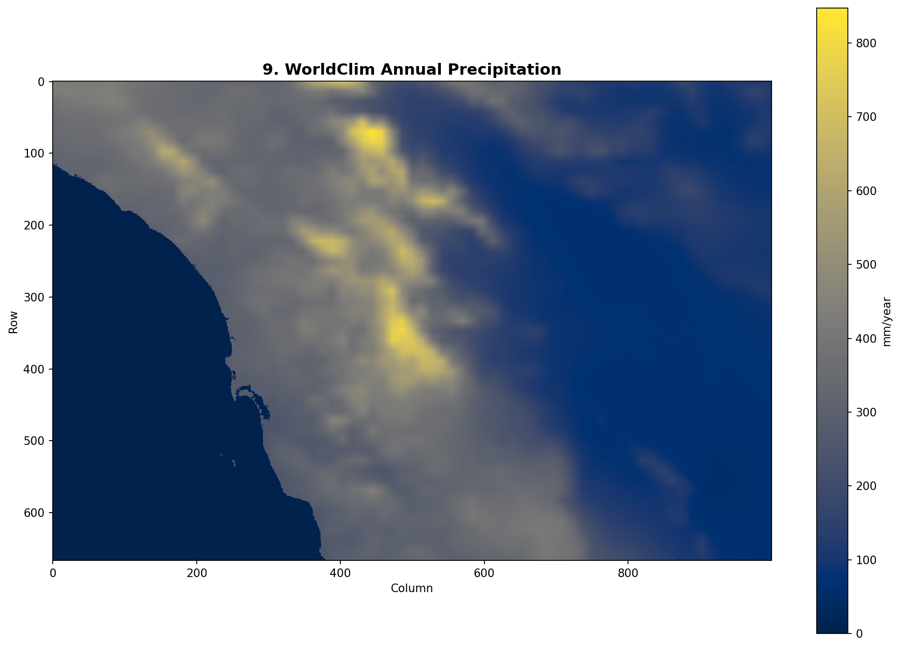
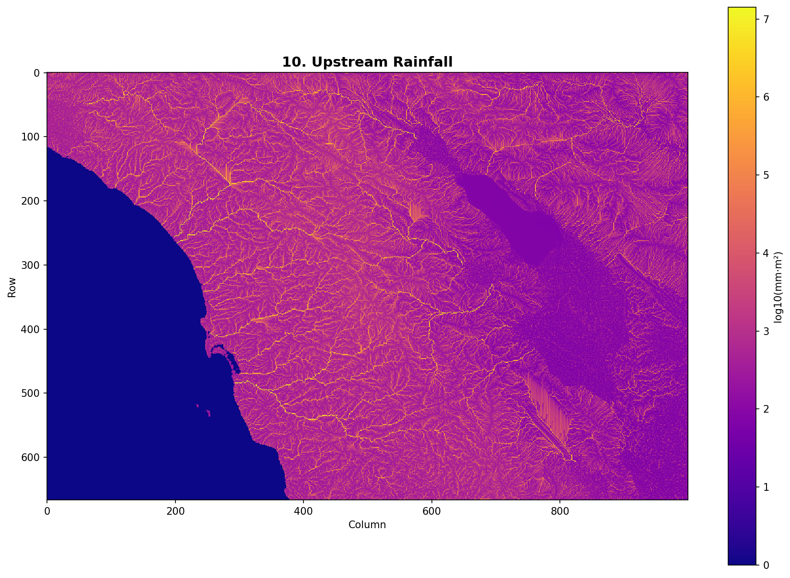
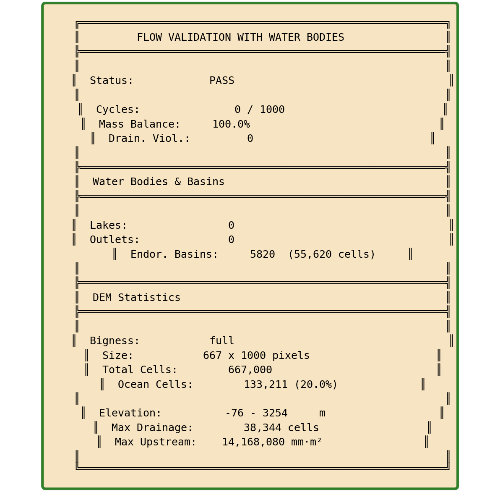

# Flow Routing and Accumulation Guide

*Last updated: 2026-02-09*

This guide documents our learnings from developing and debugging the hydrological flow routing system in terrain-maker. It covers algorithm design, implementation details, debugging strategies, and lessons learned.

## Overview

Hydrological flow routing determines how water moves across a terrain surface. The system computes:

- **Flow direction**: Which neighboring cell each cell drains to (D8 algorithm)
- **Drainage area**: How many upstream cells contribute flow to each cell
- **Upstream rainfall**: Precipitation-weighted flow accumulation

---

## Part 1: Algorithm Foundations

### The Core Problem

Given a Digital Elevation Model (DEM), we want to answer: "If a drop of water falls on cell (i,j), where does it go?"

This seems simple - water flows downhill - but complications arise:

1. **Depressions (pits)**: Natural and artificial sinks where water pools
2. **Flat areas**: Zero-slope regions with no obvious flow direction
3. **NoData boundaries**: Ocean, lakes, domain edges
4. **Numerical precision**: Floating-point artifacts create false gradients

### Why D8?

D8 (8-direction) flow assigns each cell exactly one of 8 possible flow directions (or no flow for sinks). Alternatives exist:

| Algorithm | Description | Trade-offs |
|-----------|-------------|------------|
| **D8** | Single steepest descent neighbor | Simple, fast, but can create parallel flow on hillslopes |
| **D-infinity** | Proportional flow based on slope angle | More realistic divergence, but complex accumulation |
| **MFD** | Multiple flow directions weighted by slope | Best for diffuse flow, expensive to compute |

We chose D8 because:
- Simpler accumulation (topological sort works directly)
- Sufficient for stream network extraction
- Standard in GIS tools (ESRI, GRASS, QGIS)
- Easier to debug and validate

### The Four-Stage Pipeline

Our implementation follows a spec-compliant pipeline based on peer-reviewed literature:

```
┌─────────────────────────────────────────────────────────────────┐
│                    STAGE 1: OUTLET IDENTIFICATION               │
│  Classify cells that serve as drainage termini                  │
│  (coastal, edge, masked basin outlets)                          │
└─────────────────────────────────────────────────────────────────┘
                              │
                              ▼
┌─────────────────────────────────────────────────────────────────┐
│               STAGE 2a: CONSTRAINED BREACHING                   │
│  Carve least-cost paths from sinks to outlets                   │
│  Subject to max_breach_depth and max_breach_length              │
│  Algorithm: Dijkstra shortest path (Lindsay 2016)               │
└─────────────────────────────────────────────────────────────────┘
                              │
                              ▼
┌─────────────────────────────────────────────────────────────────┐
│                STAGE 2b: RESIDUAL FILL                          │
│  Priority-flood fill remaining sinks with epsilon gradient      │
│  Algorithm: Barnes et al. (2014)                                │
└─────────────────────────────────────────────────────────────────┘
                              │
                              ▼
┌─────────────────────────────────────────────────────────────────┐
│                 STAGE 3: D8 FLOW DIRECTION                      │
│  Assign steepest descent direction to each cell                 │
│  Every non-sink cell now has exactly one lower neighbor         │
└─────────────────────────────────────────────────────────────────┘
                              │
                              ▼
┌─────────────────────────────────────────────────────────────────┐
│                 STAGE 4: FLOW ACCUMULATION                      │
│  Count upstream contributing cells via topological sort         │
│  Kahn's algorithm ensures correct dependency order              │
└─────────────────────────────────────────────────────────────────┘
```

---

## Part 2: Stage 1 - Outlet Identification

### The Key Insight

Before any conditioning, we must know WHERE water can exit the domain. This seems obvious but has subtleties:

**Wrong approach**: "Just let water flow off edges"
- Creates artificial endorheic basins if interior cells are lower than edges
- Produces inconsistent results depending on domain boundary placement

**Right approach**: Explicitly classify outlets FIRST, then condition terrain to drain to them.

### Outlet Types

| Type | Description | Detection | Example |
|------|-------------|-----------|---------|
| **Coastal** | Adjacent to ocean/NoData, below threshold | `elev < coastal_elev_threshold AND adjacent_to_nodata` | River mouths |
| **Edge** | On grid boundary | Configurable strategy | Domain boundaries |
| **Masked Basin** | Adjacent to pre-masked interior NoData | User-supplied masks | Lakes, endorheic basins |

### Edge Mode Strategies

The `edge_mode` parameter controls how boundary cells become outlets:

```python
# All boundary cells are outlets (safest, prevents artificial basins)
edge_mode = "all"

# Only boundary cells that are local minima along the edge
edge_mode = "local_minima"

# Cells where interior neighbors slope toward the edge
edge_mode = "outward_slope"

# No edge outlets (for islands surrounded by ocean)
edge_mode = "none"
```

**What we learned**: `edge_mode="all"` is the safest default. The cost is some edge fragmentation, but this is far preferable to creating artificial closed basins that trap water.

### Implementation Pattern: Neighbor Iteration

A pattern we use throughout the codebase for 8-connected neighbors:

```python
# D8 direction codes (ESRI convention) and offsets
D8_CODES = [1, 2, 4, 8, 16, 32, 64, 128]
D8_OFFSETS = [
    (0, 1),   # 1: East
    (-1, 1),  # 2: NE
    (-1, 0),  # 4: North
    (-1, -1), # 8: NW
    (0, -1),  # 16: West
    (1, -1),  # 32: SW
    (1, 0),   # 64: South
    (1, 1),   # 128: SE
]

# Iterate neighbors
for code, (dr, dc) in zip(D8_CODES, D8_OFFSETS):
    nr, nc = r + dr, c + dc
    if 0 <= nr < rows and 0 <= nc < cols:
        # Process neighbor
        pass
```

**Why ESRI codes?** Compatibility with ArcGIS, QGIS, and other GIS tools. The power-of-2 encoding also allows bitwise operations for multi-flow algorithms.

---

## Part 3: Stage 2a - Constrained Breaching

### The Problem with Simple Filling

Traditional depression filling raises ALL sink cells to their spill point elevation. This:

1. **Destroys terrain detail**: Small valleys become plateaus
2. **Creates large flat areas**: Problematic for flow direction
3. **Doesn't distinguish real vs. artificial sinks**: Sensor noise treated same as Death Valley

### Lindsay's Constrained Breaching

The insight: Instead of raising sinks, LOWER the barriers. Carve narrow channels through ridges to drain depressions.

**Key parameters**:

| Parameter | Meaning | Too Low | Too High |
|-----------|---------|---------|----------|
| `max_breach_depth` | Max elevation cut per cell | Many sinks survive to fill | Cuts through real ridges |
| `max_breach_length` | Max path length in cells | Long sinks can't breach | Cuts across wide barriers |

### Algorithm: Dijkstra Least-Cost Path

For each sink, find the cheapest path to a draining cell:

```
DIJKSTRA_BREACH(sink_cell, max_depth, max_length):

    # Priority queue: (cost, path_length, row, col)
    PQ = MinHeap()
    PQ.push((0, 0, sink_r, sink_c))

    visited = {}
    parent = {}
    sink_elev = DEM[sink_r, sink_c]

    while PQ not empty:
        cost, length, r, c = PQ.pop()

        if (r, c) in visited:
            continue
        visited[(r, c)] = cost

        # Termination: reached a cell that drains
        if resolved[r, c] and DEM[r, c] <= sink_elev:
            return reconstruct_path(parent, sink, (r, c))

        if outlet[r, c]:
            return reconstruct_path(parent, sink, (r, c))

        # Don't expand beyond max_length
        if length >= max_length:
            continue

        for each neighbor (nr, nc):
            if (nr, nc) in visited or nodata[nr, nc]:
                continue

            # Cost = how much we'd have to cut this cell
            breach_depth = max(0, DEM[nr, nc] - sink_elev)

            if breach_depth > max_depth:
                continue  # Would exceed constraint

            new_cost = cost + breach_depth
            PQ.push((new_cost, length + 1, nr, nc))
            parent[(nr, nc)] = (r, c)

    return None  # No valid breach path
```

### Critical Insight: Cost Metric

The cost metric determines breach behavior:

| Cost = | Behavior | Good For |
|--------|----------|----------|
| `max(0, elev - sink_elev)` | Minimize total material removed | General use |
| `1` (constant) | Find shortest path | Noisy DEMs |
| `elev - sink_elev` (can be negative) | Find steepest descent | Preserving slopes |

We use **total material removed** because it finds the path that disturbs terrain the least.

### Applying the Breach

Once we have a path, we carve it with monotonically decreasing elevation:

```python
def apply_breach(dem, path, epsilon):
    # Work backward from drain point to sink
    # Ensure each cell is lower than the previous

    n = len(path)
    base_elev = dem[path[-1]]  # Drain point elevation

    for i in range(n - 2, -1, -1):  # Reverse order
        r, c = path[i]
        required_elev = base_elev + epsilon * (n - 1 - i)

        # Only lower, never raise
        if dem[r, c] > required_elev:
            dem[r, c] = required_elev
```

**Why epsilon gradient?** Ensures the carved channel has consistent downward slope, preventing flat spots that confuse D8.

---

## Part 4: Stage 2b - Priority-Flood Fill

### Barnes (2014) Algorithm

For sinks that couldn't be breached, fill them minimally:

```
PRIORITY_FLOOD_FILL(dem, outlets, epsilon):

    PQ = MinHeap()
    in_queue = array of False

    # Seed with all outlets
    for each outlet (r, c):
        PQ.push((dem[r, c], r, c))
        in_queue[r, c] = True

    while PQ not empty:
        elev, r, c = PQ.pop()

        for each neighbor (nr, nc):
            if in_queue[nr, nc] or nodata[nr, nc]:
                continue

            in_queue[nr, nc] = True

            # If neighbor is lower, raise it
            if dem[nr, nc] < elev + epsilon:
                dem[nr, nc] = elev + epsilon

            PQ.push((dem[nr, nc], nr, nc))
```

### Why Priority Queue?

The priority queue ensures we process cells in order of ascending elevation. This guarantees:

1. When we visit a cell, all lower cells are already resolved
2. Fill happens from outlet inward, naturally creating drainage gradient
3. No cell is visited more than once

### The Epsilon Gradient

The `epsilon` parameter deserves special attention:

| Epsilon Value | Effect |
|---------------|--------|
| Too small (< 1e-6) | Float precision errors create ties/reversals |
| Too large (> 1e-2) | Distorts elevations in large filled areas |
| Sweet spot (~1e-4) | Clear gradient without distortion |

**Rule of thumb**: `epsilon = 1e-5 * cell_resolution`

For a 30m DEM: `epsilon = 3e-4`
For a 10m DEM: `epsilon = 1e-4`

---

## Part 5: Stage 3 - D8 Flow Direction

### After Conditioning

Post-conditioning, every land cell (except outlets) has at least one lower neighbor. D8 is now straightforward:

```python
def compute_d8_flow_direction(dem, nodata, outlets):
    rows, cols = dem.shape
    flow_dir = np.zeros((rows, cols), dtype=np.uint8)

    for r in range(rows):
        for c in range(cols):
            if nodata[r, c]:
                flow_dir[r, c] = 0
                continue

            if outlets[r, c]:
                flow_dir[r, c] = 0  # Terminal
                continue

            # Find steepest descent
            max_slope = -np.inf
            best_dir = 0

            for code, (dr, dc) in zip(D8_CODES, D8_OFFSETS):
                nr, nc = r + dr, c + dc

                if not in_bounds(nr, nc) or nodata[nr, nc]:
                    continue

                dist = np.sqrt(dr*dr + dc*dc)  # 1.0 or sqrt(2)
                slope = (dem[r, c] - dem[nr, nc]) / dist

                if slope > max_slope:
                    max_slope = slope
                    best_dir = code

            flow_dir[r, c] = best_dir

    return flow_dir
```

### Diagonal Distance Matters

A subtle but important detail: diagonal neighbors are further away (sqrt(2) vs 1.0). We must compute **slope**, not just elevation difference:

```python
# WRONG: Biases toward diagonals
score = dem[r, c] - dem[nr, nc]

# RIGHT: Accounts for distance
dist = 1.0 if dr == 0 or dc == 0 else 1.414
slope = (dem[r, c] - dem[nr, nc]) / dist
```

### Handling Ties

When multiple neighbors have equal steepest slope, we need a tie-breaker. Options:

1. **Prefer cardinal directions**: N/S/E/W over diagonals
2. **Prefer lower elevation**: Among equal slopes, pick lower neighbor
3. **Random**: Adds variety but reduces reproducibility
4. **Deterministic priority**: Fixed order (e.g., E, NE, N, NW, W, SW, S, SE)

We use **deterministic priority** for reproducibility.

---

## Part 6: Stage 4 - Flow Accumulation

### The Dependency Problem

Flow accumulation has a dependency: to know how much water reaches cell A, we must first know how much water reaches all cells that drain INTO A.

This is a **topological sort** problem.

### Kahn's Algorithm

```python
def compute_flow_accumulation(flow_dir, nodata):
    rows, cols = flow_dir.shape

    # Initialize: each cell contributes 1 (itself)
    flow_acc = np.ones((rows, cols), dtype=np.int64)
    flow_acc[nodata] = 0

    # Compute in-degree (number of upstream cells)
    in_degree = np.zeros((rows, cols), dtype=np.int32)

    for r in range(rows):
        for c in range(cols):
            if flow_dir[r, c] == 0:
                continue

            nr, nc = downstream_cell(r, c, flow_dir[r, c])
            if not nodata[nr, nc]:
                in_degree[nr, nc] += 1

    # Seed queue with cells that have no upstream (headwaters)
    queue = deque()
    for r in range(rows):
        for c in range(cols):
            if not nodata[r, c] and in_degree[r, c] == 0:
                queue.append((r, c))

    cells_processed = 0

    while queue:
        r, c = queue.popleft()
        cells_processed += 1

        d = flow_dir[r, c]
        if d == 0:
            continue  # Outlet or nodata

        nr, nc = downstream_cell(r, c, d)
        if not nodata[nr, nc]:
            # Pass accumulation downstream
            flow_acc[nr, nc] += flow_acc[r, c]

            in_degree[nr, nc] -= 1
            if in_degree[nr, nc] == 0:
                queue.append((nr, nc))

    # Cycle detection
    total_land = np.sum(~nodata)
    if cells_processed != total_land:
        raise ValueError(f"Cycle detected! Processed {cells_processed}/{total_land}")

    return flow_acc
```

### Why This Works

1. **Headwaters first**: Cells with in_degree=0 have no upstream contributors
2. **Propagation**: As we process cells, their downstream neighbors' in-degrees decrease
3. **Termination**: When a cell's in-degree hits 0, all its upstream is computed
4. **Cycle detection**: If we can't reach all cells, there's a cycle (conditioning bug)

### Weighted Accumulation

For rainfall-weighted accumulation, initialize with precipitation instead of 1:

```python
# Instead of:
flow_acc = np.ones((rows, cols))

# Use:
flow_acc = precipitation.copy()
```

Everything else stays the same - the topological sort handles it.

---

## Part 7: Flat Resolution

### The Flat Area Problem

After filling, large flat areas have zero slope. D8 can't determine flow direction.

Consider a 100x100 cell lake bed at exactly 500.0m elevation. Which way does water flow?

### Garbrecht-Martz (1997) Dual-Gradient Solution

The insight: Use TWO gradients combined:

1. **Toward gradient**: Distance from pour points (water flows toward outlets)
2. **Away gradient**: Distance from high points (water flows from ridges)

```
FLAT_RESOLUTION(dem, flat_mask, pour_points, high_points):

    # Gradient 1: Distance from pour points (lower terrain)
    toward_dist = BFS_DISTANCE(flat_mask, pour_points)

    # Gradient 2: Distance from high points (higher terrain)
    away_dist = BFS_DISTANCE(flat_mask, high_points)

    # Combined: Garbrecht-Martz formula
    for each flat cell (r, c):
        increment = epsilon * (toward_dist[r, c] + away_dist[r, c])
        dem[r, c] += increment
```

### Why Both Gradients?

| Gradient | Creates Flow Pattern |
|----------|---------------------|
| Toward only | Radial flow to outlet (unrealistic) |
| Away only | Radial flow from ridges (unrealistic) |
| Combined | Natural dendritic drainage |

### Visual Comparison

```
TOWARD ONLY:           AWAY ONLY:            COMBINED:
    ↓ ↓ ↓                 ↑ ↑ ↑                ↘ ↓ ↙
    → O ←                 → · ←                → O ←
    ↑ ↑ ↑                 ↓ ↓ ↓                ↗ ↑ ↖

(O = outlet)           (· = high point)      (natural drainage)
```

### Implementation Detail: Finding High Points

A "high point" on a flat is a flat cell adjacent to HIGHER terrain:

```python
def find_high_points(dem, flat_mask):
    high_points = np.zeros_like(flat_mask)

    for r, c in flat_cells:
        for nr, nc in neighbors(r, c):
            if dem[nr, nc] > dem[r, c]:
                high_points[r, c] = True
                break

    return high_points
```

---

## Part 8: Water Body Integration

### Why Lakes Are Hard

Lakes break the fundamental D8 assumption that water flows to the lowest neighbor:

1. **Flat surface**: Lake surfaces have zero slope (or tiny wind-driven slopes)
2. **Single outlet**: All water exits through one pour point
3. **Multiple inlets**: Streams enter from various points around perimeter
4. **Internal routing**: Water must traverse the lake interior

### Our Solution: BFS Routing

For each lake, use breadth-first search from the outlet to assign flow directions:

```python
def create_lake_routing(lake_mask, outlet_mask, dem):
    flow_dir = np.zeros_like(lake_mask, dtype=np.uint8)

    for lake_id in unique_lakes:
        this_lake = (lake_mask == lake_id)
        outlet = outlet_mask & this_lake

        if not np.any(outlet):
            # Endorheic lake - no outlet
            flow_dir[this_lake] = 0
            continue

        # BFS from outlet
        visited = np.zeros_like(this_lake, dtype=bool)
        queue = deque()

        # Initialize with outlet
        for r, c in outlet_cells:
            visited[r, c] = True
            flow_dir[r, c] = 0  # Outlet is terminal
            queue.append((r, c))

        while queue:
            r, c = queue.popleft()

            for code, (dr, dc) in zip(D8_CODES, D8_OFFSETS):
                nr, nc = r + dr, c + dc

                if this_lake[nr, nc] and not visited[nr, nc]:
                    visited[nr, nc] = True
                    # Flow toward the cell we came from
                    flow_dir[nr, nc] = REVERSE_DIR[code]
                    queue.append((nr, nc))

    return flow_dir
```

### Key Insight: Lakes Have Context

**Lakes outside endorheic basins** act as CONDUITS:
- Water enters through inlets
- Flows through lake interior
- Exits through outlet
- Continues downstream

**Lakes inside endorheic basins** act as SINKS:
- Water enters and accumulates
- No outlet to the ocean
- Example: Salton Sea, Great Salt Lake

This distinction is critical and we got it wrong initially.

### Inlet Detection

Inlets are cells adjacent to lakes where terrain drains INTO the lake:

```python
def identify_inlets(lake_mask, dem, outlet_mask):
    inlets = {}

    for lake_id in unique_lakes:
        this_lake = (lake_mask == lake_id)
        lake_inlet_cells = []

        # Find cells just outside the lake
        perimeter = dilate(this_lake) & ~this_lake

        for r, c in perimeter_cells:
            # Check if terrain slopes into lake
            for nr, nc in neighbors(r, c):
                if this_lake[nr, nc] and not outlet_mask[nr, nc]:
                    if dem[r, c] > dem[nr, nc]:
                        lake_inlet_cells.append((r, c))
                        break

        inlets[lake_id] = lake_inlet_cells

    return inlets
```

---

## Part 9: Endorheic Basin Handling

### What Are Endorheic Basins?

Closed drainage systems with no outlet to the ocean:

- **Great Salt Lake** (Utah)
- **Salton Sea** (California)
- **Death Valley** (California)
- **Lake Chad** (Africa)
- **Caspian Sea** (Asia)
- **Aral Sea** (Asia)

These are REAL features, not artifacts. We must preserve them.

### Detection Algorithm

```python
def detect_endorheic_basins(dem, min_size, min_depth, exclude_mask):
    """
    Find closed basins by:
    1. Identify all local minima (sinks)
    2. Grow catchment areas
    3. Filter by size and depth
    """

    # Find local minima
    sinks = find_local_minima(dem, exclude_mask)

    basins = {}
    basin_mask = np.zeros_like(dem, dtype=bool)

    for sink_id, (sink_r, sink_c) in enumerate(sinks):
        # Grow catchment (all cells that drain to this sink)
        catchment = grow_catchment(dem, sink_r, sink_c)

        # Calculate basin metrics
        size = np.sum(catchment)
        depth = compute_fill_depth(dem, catchment)

        # Filter
        if size >= min_size and depth >= min_depth:
            basins[sink_id] = {
                'center': (sink_r, sink_c),
                'size': size,
                'depth': depth,
            }
            basin_mask |= catchment

    return basin_mask, basins
```

### Preservation Strategies

Two independent mechanisms:

| Strategy | Parameter | Logic |
|----------|-----------|-------|
| Size-based | `min_basin_size` | Large basins are likely real |
| Depth-based | `max_fill_depth` | Deep basins are likely real |

**Example configurations**:

```python
# Preserve Salton Sea-scale basins
condition_dem(dem, min_basin_size=10000, max_fill_depth=50.0)

# Only preserve very deep basins (Death Valley)
condition_dem(dem, min_basin_size=None, max_fill_depth=100.0)

# Preserve any basin > 1km² (assuming 30m cells)
condition_dem(dem, min_basin_size=1111, max_fill_depth=None)
```

---

## Part 10: Performance Optimization

### The Bottleneck: Dijkstra Breaching

For a 5000x5000 DEM with 10,000 sinks, sequential Dijkstra takes hours.

Each Dijkstra search:
- Visits O(max_breach_length²) cells
- Uses O(log n) heap operations per cell
- Total: O(n_sinks × L² × log L²)

### Solution: Parallel Dijkstra with Checkerboard Batching

**The challenge**: Naive parallelization causes race conditions when breach paths overlap.

**The insight**: If sinks are far enough apart, their breach paths can't overlap.

**Checkerboard pattern**: Divide sinks into two groups based on spatial position:

```
┌───┬───┬───┬───┬───┬───┐
│ B │   │ B │   │ B │   │   B = "Black" phase
├───┼───┼───┼───┼───┼───┤   W = "White" phase
│   │ W │   │ W │   │ W │
├───┼───┼───┼───┼───┼───┤   Grid spacing = 2 × max_breach_length
│ B │   │ B │   │ B │   │
├───┼───┼───┼───┼───┼───┤   Sinks in same phase can't have
│   │ W │   │ W │   │ W │   overlapping breach paths
└───┴───┴───┴───┴───┴───┘
```

**Implementation using Numba**:

```python
from numba import njit, prange

@njit(parallel=True)
def breach_sinks_parallel_batch(dem, sink_coords, resolved, max_depth, max_length):
    n_sinks = len(sink_coords)

    # Each sink's breach is independent in this batch
    for i in prange(n_sinks):
        r, c = sink_coords[i]

        if resolved[r, c]:
            continue

        path = dijkstra_single_sink(dem, r, c, resolved, max_depth, max_length)

        if path is not None:
            # Mark cells along path as resolved
            # (actual elevation update done serially after)
            for pr, pc in path:
                resolved[pr, pc] = True

    return resolved
```

**Performance improvement**: 10-20x on 8-core systems.

### Numba JIT Patterns We Learned

1. **Use `@njit` not `@jit`**: `nopython=True` ensures no Python fallback

2. **Pre-allocate everything**:
   ```python
   # BAD: Dynamic list growth
   result = []
   for i in range(n):
       result.append(something)

   # GOOD: Pre-allocated array
   result = np.empty(n, dtype=np.int64)
   for i in range(n):
       result[i] = something
   ```

3. **Avoid Python objects in hot loops**:
   ```python
   # BAD: Dictionary lookup in loop
   for key in keys:
       value = my_dict[key]

   # GOOD: Pre-convert to arrays
   key_array = np.array(list(my_dict.keys()))
   val_array = np.array(list(my_dict.values()))
   ```

4. **Use `prange` for parallel loops**:
   ```python
   # Sequential
   for i in range(n):
       do_work(i)

   # Parallel (with Numba)
   for i in prange(n):
       do_work(i)  # Must be independent!
   ```

5. **Typed containers for complex data**:
   ```python
   from numba.typed import List, Dict

   # Instead of Python list
   typed_list = List()
   typed_list.append(np.array([1, 2, 3]))
   ```

### Caching Flow Results

Flow computation is expensive but deterministic. Cache results:

```python
def flow_accumulation_cached(dem_path, precip_path, cache_dir=None, **params):

    # Build cache key from parameters
    cache_key = _compute_cache_key(dem_path, params)
    cache_file = cache_dir / f"flow_{cache_key}.npz"

    if cache_file.exists():
        # Validate cache (check DEM modification time, params)
        if _validate_cache(cache_file, dem_path, params):
            return _load_cache(cache_file)

    # Compute fresh
    result = flow_accumulation(dem_path, precip_path, **params)

    # Save to cache
    _save_cache(cache_file, result, dem_path, params)

    return result
```

**Cache invalidation triggers**:
- DEM file modified
- Any parameter changed
- Different backend selected

---

## Part 11: Debugging and Validation

### The Three Validation Metrics

Every flow result should be checked for:

| Metric | Target | Failure Meaning |
|--------|--------|-----------------|
| **Cycles** | 0 | Flow direction has loops (conditioning bug) |
| **Mass Balance** | 100% | Water disappearing (fragmentation) |
| **Drainage Violations** | 0 | Water "climbing uphill" (accumulation bug) |

### Cycle Detection

During topological sort, track processed cells:

```python
cells_processed = 0
total_land = np.sum(~nodata)

while queue:
    # ... process cell ...
    cells_processed += 1

if cells_processed != total_land:
    unprocessed = total_land - cells_processed
    raise FlowCycleError(f"{unprocessed} cells stuck in cycle")
```

### Mass Balance Check

Compare total drainage at outlets to total input:

```python
def compute_mass_balance(flow_dir, drainage_area, outlets):
    # Total precipitation/cells that entered system
    total_input = np.sum(drainage_area > 0)

    # Total that reached outlets
    total_output = np.sum(drainage_area[outlets])

    return 100.0 * total_output / total_input
```

Mass balance < 100% indicates fragmentation (multiple disconnected networks).

### Drainage Violation Check

Every cell's downstream neighbor should have >= drainage area:

```python
def check_drainage_violations(flow_dir, drainage_area):
    violations = 0

    for r, c in all_cells:
        if flow_dir[r, c] == 0:
            continue

        nr, nc = downstream_cell(r, c, flow_dir[r, c])

        if drainage_area[nr, nc] < drainage_area[r, c]:
            violations += 1

    return violations
```

### Diagnostic Visualizations

Key visualizations for debugging:

1. **Drainage area (log scale)**: Shows stream network and fragmentation
2. **Flow direction arrows**: Reveals cycles and wrong directions
3. **Fill depth**: Shows where conditioning modified terrain
4. **Outlet locations**: Verifies outlet identification
5. **Stream network over DEM**: Confirms rivers follow valleys

---

## Part 12: What We Tried That Didn't Work

### Attempt 1: Treating All Lakes as Sinks

**Approach**: Mask all water bodies, route all flow INTO lakes.

**Problem**: Rivers like the Colorado flow THROUGH lakes. The water doesn't stop at Lake Mead - it continues to the Pacific.

**Solution**: Only treat lakes inside endorheic basins as sinks.

### Attempt 2: Single-Gradient Flat Resolution

**Approach**: BFS from pour points only, add distance-based elevation increment.

**Problem**: Creates unrealistic radial drainage patterns on flat areas.

**Solution**: Garbrecht-Martz dual-gradient (toward + away).

### Attempt 3: Aggressive Coastal Flow Override

**Approach**: Force all cells adjacent to ocean to flow directly to ocean.

**Problem**: Fragmented coastal drainage networks. Rivers terminated prematurely.

**Solution**: Only override flow for pit cells (flow_dir == 0).

### Attempt 4: Naive Parallel Dijkstra

**Approach**: Parallelize all Dijkstra breaching with standard Python multiprocessing.

**Problems**:
1. Race conditions when breach paths overlap
2. GIL prevents true parallelism
3. Serialization overhead for large arrays

**Solution**: Checkerboard batching with Numba prange.

### Attempt 5: High Epsilon for Noise Reduction

**Approach**: Use `epsilon=1e-2` to overwhelm sensor noise.

**Problem**: Created obvious staircase artifacts in filled areas.

**Solution**: Use `epsilon=1e-4` and rely on breaching to handle noise.

### Attempt 6: Filling Before Outlet Identification

**Approach**: Fill all depressions first, then identify outlets.

**Problem**: Artificial basins formed at boundaries where interior cells were lower than edges.

**Solution**: Always identify outlets FIRST, then condition terrain to drain toward them.

---

## Part 13: Edge Cases and Gotchas

### The Off-by-One Flow Direction Bug

D8 direction codes encode WHERE WATER FLOWS TO, not where it came from:

```
Code 1 (East): Water at (r, c) flows TO (r, c+1)
Code 64 (South): Water at (r, c) flows TO (r+1, c)
```

Confusing this creates flows that appear to go uphill.

### The Diagonal Distance Bug

Forgetting to account for diagonal distance:

```python
# BUG: Diagonal slopes appear steeper than they are
slope = dem[r, c] - dem[nr, nc]

# FIX: Normalize by distance
dist = np.sqrt((nr - r)**2 + (nc - c)**2)
slope = (dem[r, c] - dem[nr, nc]) / dist
```

### The Integer Overflow Bug

Drainage area can exceed 2^31 for large DEMs:

```python
# BUG: Overflow at ~2 billion cells
drainage_area = np.zeros((rows, cols), dtype=np.int32)

# FIX: Use 64-bit integers
drainage_area = np.zeros((rows, cols), dtype=np.int64)
```

### The Float Equality Bug

Comparing floats for equality is dangerous:

```python
# BUG: May fail due to precision
if dem[r, c] == dem[nr, nc]:
    # handle flat

# FIX: Use tolerance
if abs(dem[r, c] - dem[nr, nc]) < epsilon:
    # handle flat
```

### The Coordinate System Bug

GeoTiffs use (col, row) for transforms, numpy uses (row, col):

```python
# WRONG: Numpy indexing into transform
lon, lat = transform * (row, col)

# RIGHT: Transform expects (col, row)
lon, lat = transform * (col, row)
```

### The Rasterization Alignment Bug

When rasterizing vector data (lakes, streams), alignment matters:

```python
# BUG: Off-by-one pixel alignment
lake_mask = rasterize(lakes, out_shape=dem.shape)

# FIX: Use same transform as DEM
lake_mask = rasterize(lakes, out_shape=dem.shape, transform=dem_transform)
```

---

## Part 14: Testing Strategies

### Unit Tests for Each Stage

```python
class TestOutletIdentification:
    def test_coastal_outlets_low_elevation(self):
        """Cells below threshold adjacent to ocean are outlets."""

    def test_coastal_outlets_high_elevation(self):
        """High coastal cells are NOT outlets (cliffs)."""

    def test_edge_outlets_all_mode(self):
        """All boundary cells are outlets in 'all' mode."""

    def test_masked_basin_outlets(self):
        """Cells adjacent to interior NoData are outlets."""


class TestConstrainedBreaching:
    def test_breach_finds_shortest_path(self):
        """Breach finds minimum-cost path to outlet."""

    def test_breach_respects_depth_constraint(self):
        """Breach fails if max_depth exceeded."""

    def test_breach_respects_length_constraint(self):
        """Breach fails if max_length exceeded."""


class TestPriorityFloodFill:
    def test_fill_creates_monotonic_gradient(self):
        """After fill, every cell has a lower neighbor."""

    def test_fill_preserves_higher_terrain(self):
        """Cells higher than spill point unchanged."""


class TestFlowDirection:
    def test_steepest_descent(self):
        """Flow goes to steepest downslope neighbor."""

    def test_diagonal_distance(self):
        """Diagonal distance properly accounted for."""


class TestFlowAccumulation:
    def test_headwater_cells_have_acc_one(self):
        """Cells with no upstream have accumulation = 1."""

    def test_accumulation_increases_downstream(self):
        """Downstream cells have >= upstream accumulation."""

    def test_cycle_detection(self):
        """Cycles raise exception."""
```

### Integration Tests

```python
class TestFullPipeline:
    def test_san_diego_coastal_dem(self):
        """Full pipeline on real San Diego DEM."""
        result = flow_accumulation("san_diego.tif")

        assert result['cycles'] == 0
        assert result['mass_balance'] > 95.0
        assert result['drainage_violations'] == 0

    def test_salton_sea_basin_preservation(self):
        """Salton Sea basin preserved, not filled."""
        result = flow_accumulation("salton_sea.tif",
                                   min_basin_size=10000)

        # Check basin not filled
        basin_center = (row, col)
        assert result['dem_conditioned'][basin_center] < 0
```

### Visual Regression Tests

For flow algorithms, visual inspection catches bugs unit tests miss:

```python
def test_visual_stream_network():
    result = flow_accumulation("test_dem.tif")

    # Generate visualization
    fig = plot_stream_network(result)
    fig.savefig("test_output.png")

    # Compare to known-good baseline
    assert images_match("test_output.png", "baseline_output.png",
                        tolerance=0.01)
```

---

## Part 15: Lessons Learned Summary

### Algorithm Design

1. **Stage order matters**: Outlets FIRST, then conditioning, then flow
2. **Breaching > Filling**: Preserves terrain detail, handles noise
3. **Dual-gradient flat resolution**: Single gradient creates unrealistic patterns
4. **Explicit outlet identification**: Prevents artificial basins

### Implementation

1. **Pre-allocate arrays**: Avoids memory churn in hot loops
2. **Use Numba for inner loops**: 10-100x speedup
3. **Checkerboard batching for parallelism**: Avoids race conditions
4. **Cache expensive computations**: Flow results are deterministic

### Debugging

1. **Three metrics always**: Cycles, mass balance, drainage violations
2. **Visualize everything**: Drainage area (log), flow arrows, fill depth
3. **Test on simple synthetic DEMs**: Isolates algorithm bugs
4. **Test on real DEMs**: Catches edge cases

### Gotchas

1. **D8 codes = where water flows TO**: Not where it came from
2. **Diagonal distance**: Must normalize slope by distance
3. **Coordinate systems**: GeoTiff (col, row) vs numpy (row, col)
4. **Float equality**: Use epsilon tolerance
5. **Integer overflow**: Use int64 for drainage area

### Water Bodies

1. **Lakes are context-dependent**: Sinks in basins, conduits elsewhere
2. **Pre-mask before conditioning**: Cleaner than post-hoc fixes
3. **BFS for internal routing**: Guarantees convergence to outlet
4. **Inlet detection aids validation**: Shows where streams enter

---

## Part 16: Example Output - San Diego with HydroLAKES

The following visualizations demonstrate the complete flow routing pipeline applied to a San Diego DEM with HydroLAKES water body data. Run the example with:

```bash
python examples/validate_flow_with_water_bodies.py --bigness full --data-source hydrolakes
```

### Pipeline Visualization Outputs

**1. Original DEM**


The raw Digital Elevation Model showing terrain elevation. Blue represents ocean/low areas, green/brown shows land elevation gradients.

**2. Ocean Mask**


Binary mask identifying ocean cells (yellow) vs land cells (purple). Ocean cells act as outlets for coastal drainage.

**3. Water Bodies with Inlets/Outlets**


Lakes and reservoirs from HydroLAKES database overlaid on the DEM. Red arrows indicate lake outlets (where water exits), green arrows show inlets (where streams enter lakes).

**3b. Endorheic Basins**



Automatically detected closed drainage basins that don't drain to the ocean. These are preserved during conditioning to maintain realistic topography.

**4. Conditioned DEM**



DEM after depression filling/breaching. Artificial sinks have been removed while preserving natural basins and water bodies.

**5. Fill Depth**



Amount of elevation modification during conditioning (log scale). Lighter colors indicate areas where depressions were filled.

**6. D8 Flow Direction**



D8 flow direction codes (1-128) showing which neighbor each cell drains to. Different colors represent the 8 possible flow directions.

**7. Drainage Area**



Upstream contributing area for each cell (log scale). Brighter areas have more upstream cells draining through them, revealing the stream network.

**8. Stream Network with Lakes**



Extracted stream network (top 5% drainage area) overlaid on elevation with lakes highlighted. Shows how streams connect through water bodies.

**9. Precipitation**



Input precipitation data (synthetic elevation-based or real WorldClim data when available). Used for rainfall-weighted accumulation.

**10. Upstream Rainfall**



Precipitation-weighted flow accumulation (log scale). Shows total upstream rainfall contributing to each cell.

**10b. Discharge Potential (Log Scale)**


Combined drainage area and rainfall metric showing potential water discharge. Highlights where the largest flows occur.

**10c. Discharge Potential (Linear Scale)**


Same discharge metric on linear scale, emphasizing absolute magnitude of major waterways.

**11. Validation Summary**



Summary of validation metrics: cycles (should be 0), mass balance (should be >95%), drainage violations, and statistics about water bodies and basins.

### Key Observations

1. **Water bodies act as conduits**: Lakes outside endorheic basins route water through to their outlets, maintaining river connectivity.

2. **Endorheic basins preserved**: Closed drainage systems are automatically detected and protected from artificial filling.

3. **Stream network follows valleys**: The extracted network (panel 8) shows realistic dendritic patterns following terrain low points.

4. **Mass balance validation**: The summary panel confirms no water is lost in the routing process.

---

## References

### Primary Algorithm Papers

- Barnes, R., Lehman, C., & Mulla, D. (2014). Priority-flood: An optimal depression-filling and watershed-labeling algorithm for digital elevation models. *Computers & Geosciences*, 62, 117-127.

- Garbrecht, J., & Martz, L.W. (1997). The assignment of drainage direction over flat surfaces in raster digital elevation models. *Journal of Hydrology*, 193, 204-213.

- Lindsay, J.B. (2016). Efficient hybrid breaching-filling sink removal methods for flow path enforcement in digital elevation models. *Hydrological Processes*, 30, 846-857.

### Classic References

- O'Callaghan, J.F., & Mark, D.M. (1984). The extraction of drainage networks from digital elevation data. *Computer Vision, Graphics, and Image Processing*, 28, 323-344.

- Jenson, S.K., & Domingue, J.O. (1988). Extracting topographic structure from digital elevation data for geographic information system analysis. *Photogrammetric Engineering and Remote Sensing*, 54, 1593-1600.

- Tarboton, D.G. (1997). A new method for the determination of flow directions and upslope areas in grid digital elevation models. *Water Resources Research*, 33, 309-319.

### Additional Resources

- Lindsay, J.B., & Creed, I.F. (2005). Removal of artifact depressions from digital elevation models. *Hydrological Processes*, 19, 3113-3126.

- Barnes, R. (2016). Parallel priority-flood depression filling for trillion cell digital elevation models on desktops or clusters. *Computers & Geosciences*, 96, 56-68.

---

## See Also

- [flow-spec.md](../../../flow-spec.md) - Full algorithm specification
- [FLOW_TESTING_GUIDE.md](../../../examples/FLOW_TESTING_GUIDE.md) - Testing procedures
- [API: flow_accumulation](../api/flow_accumulation.rst) - Function reference
